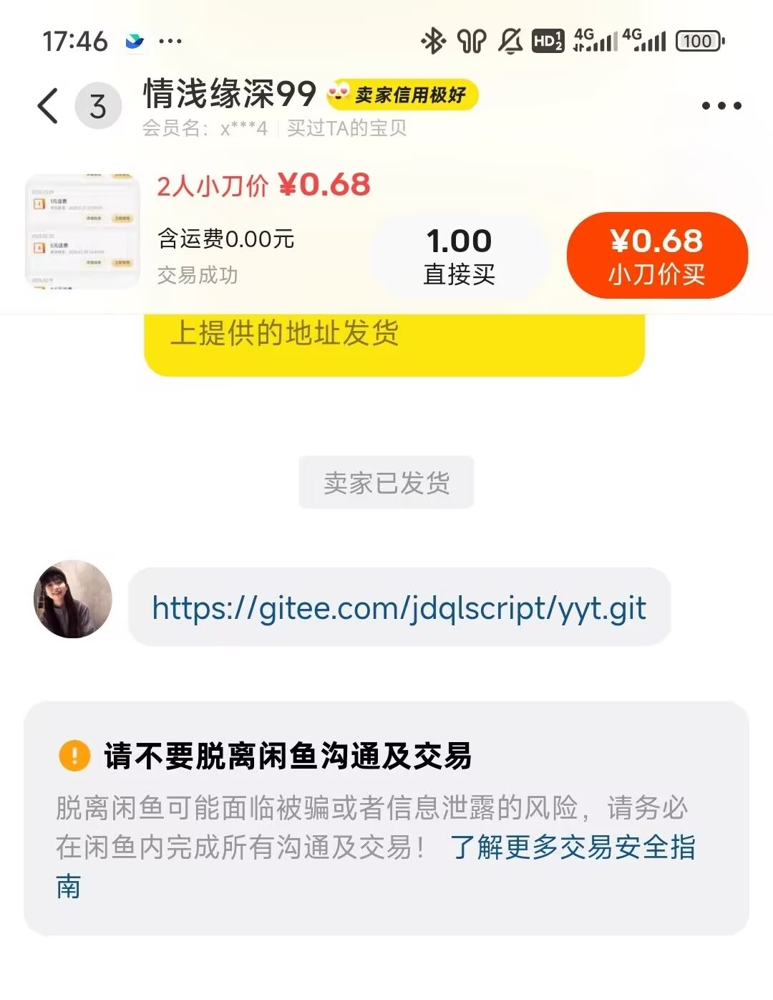
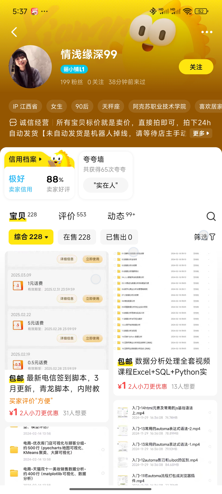

# yyt
## 倒卖狗
无意中发现一个倒卖狗，你们找他更新吧我不更新了


下面带上商品链接和咸鱼主页
```angular2html
【闲鱼】https://m.tb.cn/h.6wpmrsE?tk=nmAHVmKPqog HU071 「快来捡漏【最新电信签到脚本，3月更新，青龙脚本，内附教程。】」
点击链接直接打开

【闲鱼】https://m.tb.cn/h.6xX2fXj?tk=PLbsVnfleXq HU293 「情浅缘深99的闲鱼号，快来关注TA吧～」
点击链接直接打开
```
#### 介绍
营业厅脚本，收集自互联网 好用欢迎打赏


## 使用方法

### 拉库


```
ql repo https://gitee.com/jdqlscript/yyt.git "电信|电信2" "" "" ""
```

### 订阅管理 --> 创建订阅 

```
名称 yyt
链接 https://gitee.com/jdqlscript/yyt.git
定时规则 1 1 1 1 1 1
```

## 镜像源
```
Node 软件包镜像源
https://registry.npmmirror.com
Python 软件包镜像源
https://mirrors.aliyun.com/pypi/simple/
Linux 软件包镜像源
https://mirrors.aliyun.com
```


## 电信配置
### node 依赖

```
xmldom
node-rsa	
tough-cookie	
crypto-js	
nodemailer	
got@10.0.0	
crypto-js	
nodemailer
```


### python 依赖

```
tenacity
pandas
tabulate
bs4
httpx==0.23.2	
httpx	
pycryptodome	
aiohttp	
PyExecJS	
dailycheckin
```
### 配置文件

```
export NODE_OPTIONS="--tls-min-v1.0 --tls-cipher-list=DEFAULT:@SECLEVEL=1"

## 签到环境变量
## 自己设置电信的服务密码, 把 手机号#服务密码 填到变量里, 多账号&隔开: 
## 或者使用 面板环境变量功能新增即可
export chinaTelecomAccount="138000000#111111&138000000#111111"

```

## 电信2配置
### node 依赖

```
moment
jsdom
node-jsencrypt
axios
xmldom
node-rsa
tough-cookie
crypto-js
nodemailer
got@10.0.0
```


### python 依赖

```
tenacity
pandas
tabulate
bs4
httpx==0.23.2
pycryptodome
aiohttp
PyExecJS
dailycheckin
```
### 配置文件

```
export NODE_OPTIONS="--tls-min-v1.0 --tls-cipher-list=DEFAULT:@SECLEVEL=1"

## 签到环境变量
## 自己设置电信的服务密码, 把 手机号#服务密码 填到变量里, 多账号&隔开: 
## 或者使用 面板环境变量功能新增即可
export dx="138000000#111111&138000000#111111"

```
### 注意
此版本需要 2.16.5版本的青龙面板或者Node 版本为18才可运行js脚本

## 定时规则
定时规则请按需要自行配置，不懂百度

## 拉python库如果 pycryptodome dailycheckin 换源了也拉可参考我的步骤
进入容器控制台

将默认的源替换为国内镜像源（如阿里云、清华大学等）：
### Linux
```bash
sed -i 's/dl-cdn.alpinelinux.org/mirrors.aliyun.com/g' /etc/apk/repositories
```

然后更新包列表并重新尝试安装：

```bash
apk update
apk add gcc
apk add build-base musl-dev
```

就可拉下来了

## 将阿里云镜像源添加为受信任主机
如果必须使用 HTTP 源且你信任该镜像源，可以使用 pip 的 --trusted-host 选项，允许 pip 跳过安全检查：

```bash
pip install <package-name> -i http://mirrors.aliyun.com/pypi/simple/ --trusted-host mirrors.aliyun.com

```
这样，pip 会信任该镜像源并忽略安全警告。你也可以在 pip 的配置文件中永久设置此选项。编辑 pip 的配置文件
（位于 ~/.pip/pip.conf 或 C:\Users\<username>\pip\pip.ini），并添加以下内容：

```bash
[global]
trusted-host = mirrors.aliyun.com
index-url = http://mirrors.aliyun.com/pypi/simple/

```
这样每次使用 pip 时都不再需要手动添加 --trusted-host 选项。